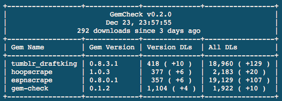

# gem-check
[](https://badge.fury.io/rb/gem-check)

A simple ruby utility to see the download count for your owned gems.

## Installation

    $ gem install gem-check

## Usage

First, create your gem credentials file as described on [rubygems.org](https://rubygems.org/profile/edit)
```
$ gem-check
```
  

### Options  

| Flag | Description|
| :--- | :---:  |
| -f | Don't save the updated stats for this run.  |
| -h | Display the help screen.  |  

### Note  
  Gem stats data stored in ~/gem-check.json  

### Display

| Column | Description |
| :--- | :---: |
| Gem Version | Latest available gem version |
| Version DLs | Download count for the displayed version of the gem |
| All DLs | Total gem download count |
| (+number) | New downloads since last recorded program run |


## Dependencies  
gems ~> 0.8.3  
terminal-table ~> 1.6

## Contributing

Bug reports and pull requests are welcome on GitHub at https://github.com/meissadia/gem-check.
