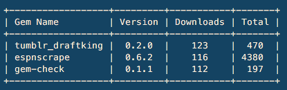

# gem-check
[](https://badge.fury.io/rb/gem-check)

A simple ruby utility to see the download count for your owned gems.

## Installation

    $ gem install gem-check

## Usage

Create your gem credentials file as described on [rubygems.org](https://rubygems.org/profile/edit)
```
$ gem-check
```


## Dependencies  
terminal-table ~> 1.6.0

## Contributing

Bug reports and pull requests are welcome on GitHub at https://github.com/meissadia/gem-check.
